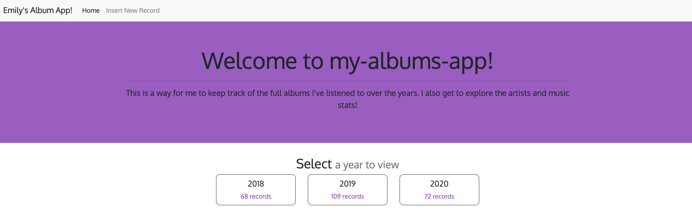
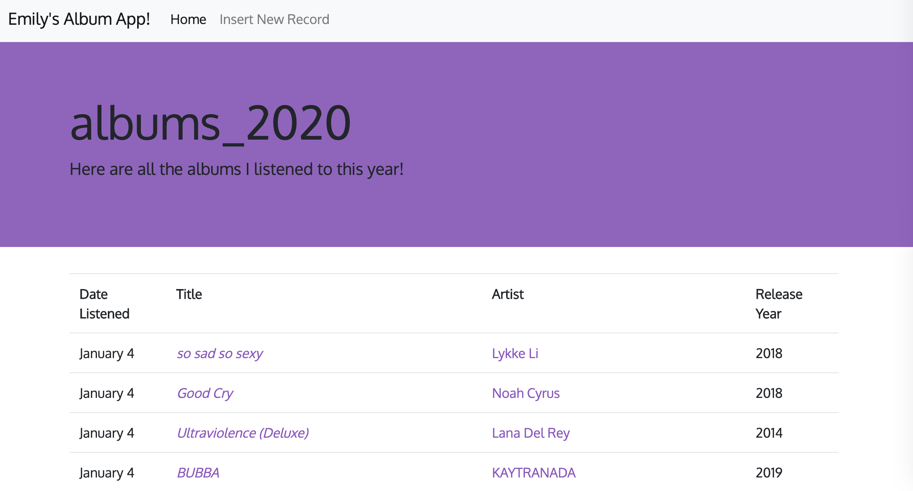
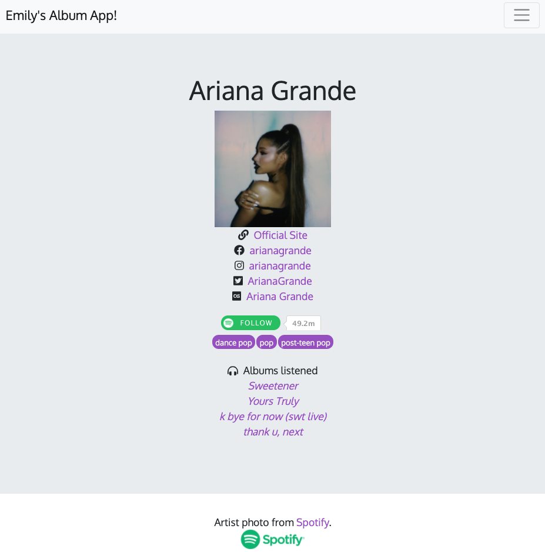
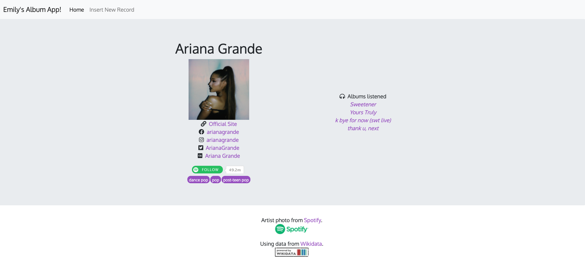
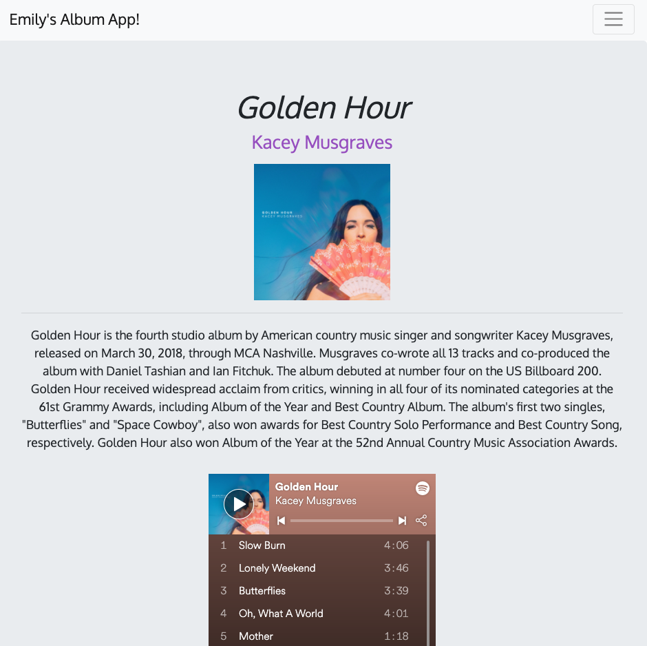
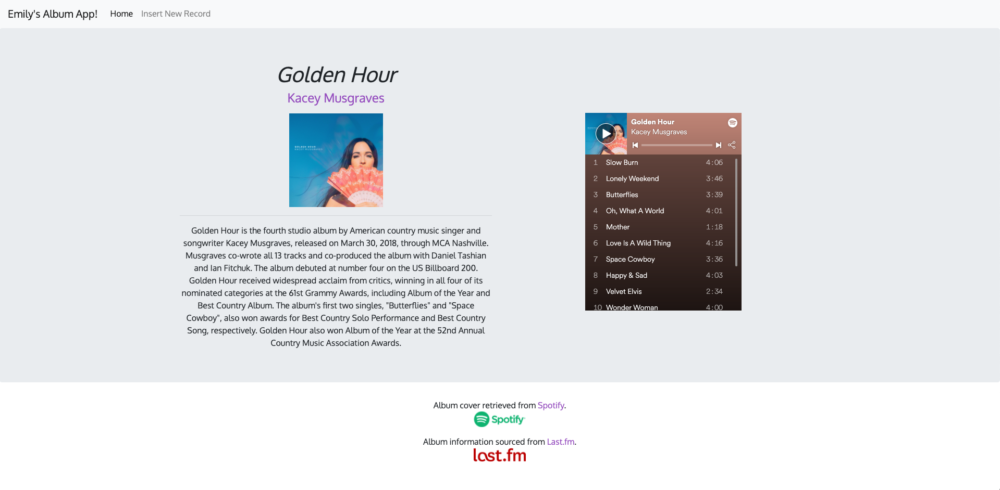

# my-albums-app

## The project
MyAlbumsApp (an unoriginal name for the project that has now stuck) is a web application that displays details about all of the albums I've listened to over the years. In 2018, I started keeping track of full albums that I listened to each year, using a MySQL database to store album titles, artist names, album release years, and the month and day I listened to an album.

Eventually I decided I wanted to create a web app to display this information. I was familiar with how to make an Angular/Flask/MySQL web app from a class I took, where a semester-long project was to build a web app with this stack, so I decided to apply that knowledge to my own personal project. I also wanted to explore using different APIs to gather more information about the music I was listening to.

MyAlbumsApp is a web application using Angular for frontend, Python/Flask for the backend, and connecting to my MySQL database that stores a lot of information. I make use of the Spotify, Wikidata, and LastFM APIs to gather more information about albums and artists. You can read below for more about my development process for this project.

After that, there are some screenshots of MyAlbumsApp! As of now, the web app is not publicly hosted. That may come in the future, but it's not a top priority at the moment. Drop me a message if you are interested in seeing more.

## About the music
I consider an "album" as anything on Spotify (my music streaming service of choice) that has 3 or more tracks. Deluxe, expanded, complete, etc. versions of an album are considered as a separate album (for example, Selena Gomez's *Rare* and then *Rare (Deluxe)*, which I listened to in January 2020 and April 2020, respectively, are 2 different album listings in my database and the app).

I do not count playlists or podcasts, strictly music albums.

Since the app displays the date listened, this usually means I make myself listen to the entire album before it goes into the database. There's been plenty of midnight listens, where the accuracy of 'Date Listened' is kinda iffy.

## Development process
- January 2019 - March 2019: Originally this was a barebones Flask app connecting to a MySQL database. A few HTML pages. The beginnings of using APIs to display more data about albums.
- March 21, 2019: I started transitioning to an Angular frontend.
- April 4, 2019: App now fetches info about albums and artists from [Spotify API](https://developer.spotify.com/documentation/web-api/) (with [Spotipy](https://spotipy.readthedocs.io/en/latest/)), [LastFM API](https://www.last.fm/api)
- April 6, 2019: App now fetches social media info about artists from [WikiData](https://www.wikidata.org/wiki/Wikidata:Main_Page).
- May 20, 2019: Moved artist functions to separate module, changes to artist fetching with new MySQL database table.
- December 2019: We're back and readying for the new year (and decade)! I am currently working on stylistic changes and adding more to the artist pages, including links to listened albums pages for albums by that artist.
- August 2020: Stats pages are up! Also, more styling for the artists and albums details pages, including responsive columns and attribution for APIs I used.

### Screenshots of web app
#### *welcome page to my-albums-app (as of August 2020)*  

#### *albums page listing all the albums I listened to in a specified year (as of August 2020)*

#### *an artist page, 1 column (as of August 2020)*  

#### *an artist page, 2 columns (as of August 2020)*  

#### *an album details page, 1 column (as of August 2020)*  

#### *an album details page, 2 columns (as of August 2020)*  

