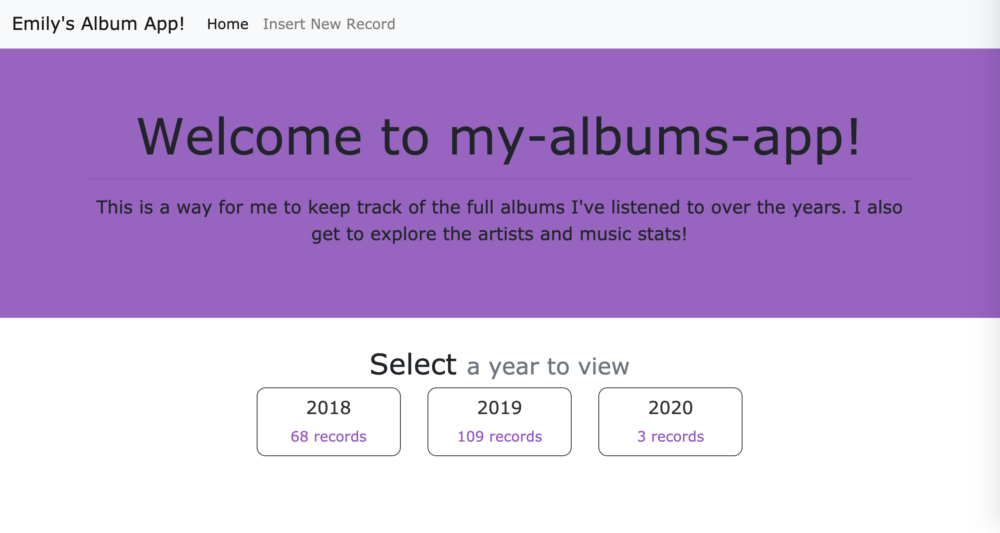

# my-albums-app

*Screenshot of the welcome page to my-albums-app (as of January 2020)*

## Development process
- January 2019 - March 2019: Originally this was a barebones Flask app connecting to a MySQL database. A few HTML pages. The beginnings of using APIs to display more data about albums.
- March 21, 2019: I started transitioning to an Angular frontend.
- April 4, 2019: App now fetches info about albums and artists from [Spotify API](https://developer.spotify.com/documentation/web-api/) (with [Spotipy](https://spotipy.readthedocs.io/en/latest/)), [LastFM API](https://www.last.fm/api)
- April 6, 2019: App now fetches social media info about artists from [WikiData](https://www.wikidata.org/wiki/Wikidata:Main_Page).
- May 20, 2019: Moved artist functions to separate module, changes to artist fetching with new MySQL database table.
- December 2019: We're back and readying for the new year (and decade)! I am currently working on stylistic changes and adding more to the artist pages, including links to listened albums pages for albums by that artist.
